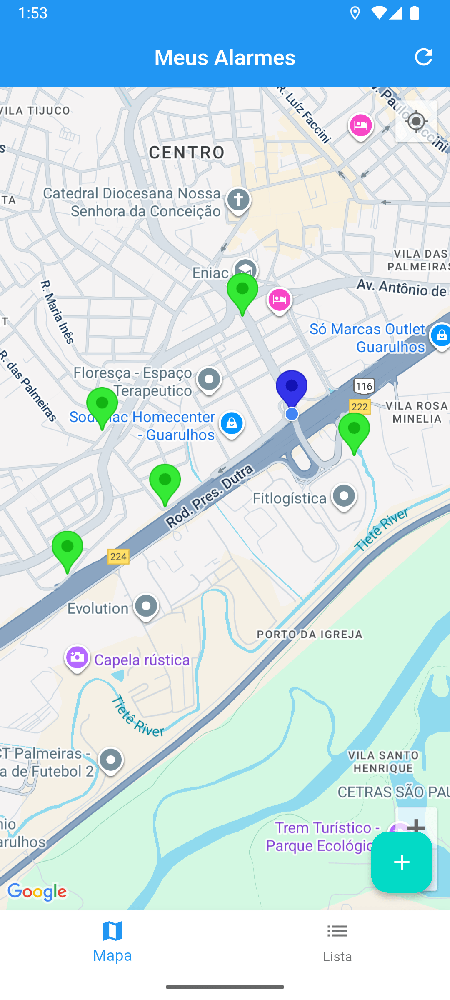
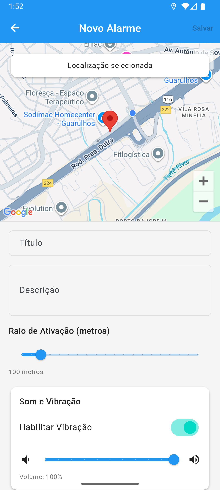
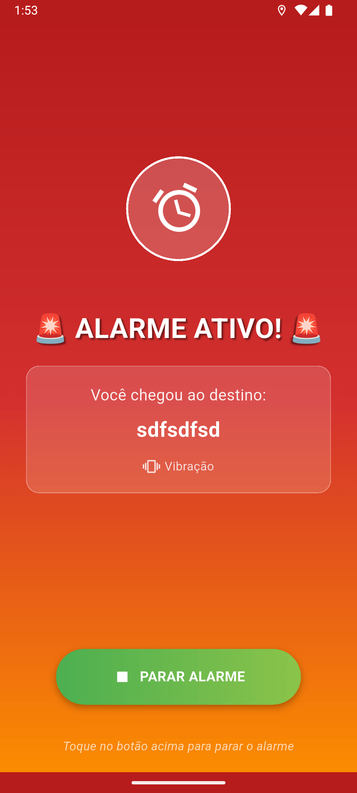

# **🚨 AcordaAI: Alarmes Baseados em Localização**

## 📃 Sobre

> **AcordaAI** é um aplicativo móvel inteligente que permite criar alarmes baseados em localização geográfica. Perfeito para quem precisa despertar em pontos específicos durante viagens de transporte público, caronas ou qualquer deslocamento. O app monitora sua localização continuamente e dispara alarmes automáticos quando você chega ao destino, garantindo que nunca mais passe do ponto dormindo!

### **Principais Recursos**

- 📍 **Marcação por Pin**: Toque no mapa para marcar localizações com precisão
- 🚨 **Alarmes Automáticos**: Disparo inteligente ao chegar no destino
- 🗺️ **Interface de Mapa**: Visualização interativa com Google Maps
- 🔔 **Som e Vibração**: Alertas intensos para despertar eficazmente
- 📱 **Múltiplos Alarmes**: Gerencie vários pontos simultâneos
- 💤 **Funcionamento em Background**: Monitora mesmo com app fechado
- 🌐 **Uso Offline**: Funciona sem necessidade de internet constante

### **Casos de Uso Principais**

- 🚌 **Transporte Público**: Despertar no ponto certo durante viagens
- 🚗 **Caronas e Viagens**: Acordar ao chegar no destino em trajetos longos  
- 📍 **Lembretes de Chegada**: Alertas ao chegar no trabalho, escola ou compromissos
- ✈️ **Viagens de Longa Distância**: Descansar com segurança durante o trajeto

### **Screenshots**

<p align="middle">
    
    
    
    
</p>

---

## 🚀 Configurando para Utilizar

### **Pré-requisitos**

#### **Instalação do Flutter**

Certifique-se de que o Flutter SDK está instalado e configurado:

```bash
flutter doctor
```

Se não tiver o Flutter instalado, siga as [instruções oficiais](https://docs.flutter.dev/get-started/install).

#### **Google Maps API Key**

O projeto requer uma chave da API do Google Maps:

1. Acesse o [Google Cloud Console](https://console.cloud.google.com/)
2. Crie um projeto e ative as APIs:
   - Maps SDK for Android
   - Maps SDK for iOS
   - Geocoding API
3. Gere uma API key
4. Configure a chave nos arquivos:
   - `android/app/src/main/AndroidManifest.xml`
   - `ios/Runner/AppDelegate.swift`

Consulte o arquivo `API_KEY_SETUP.md` para instruções detalhadas.

### **Inicializando o Projeto**

1. Clone o repositório:
   ```bash
   git clone https://github.com/seu-usuario/acorda_ai_app.git
   ```

2. Acesse a pasta do projeto:
   ```bash
   cd acorda_ai_app
   ```

3. Instale as dependências:
   ```bash
   flutter pub get
   ```

4. Configure as permissões (já configurado):
   - **Android**: Localização, notificações, background
   - **iOS**: Localização, background modes

5. Execute o projeto:
   ```bash
   flutter run
   ```

---

## 🧩 Guidelines

### **Commits Pattern**

- **feat:** Nova funcionalidade
- **fix:** Correção de bugs
- **style:** Alterações de estilo/formatação
- **refactor:** Melhorias de código sem mudança funcional
- **docs:** Documentação
- **perf:** Otimizações de performance
- **test:** Testes
- **chore:** Configurações e dependências

Exemplo:
```bash
git commit -m "feat: adiciona página de alarme ativo com som e vibração"
```

### **Branch Pattern**

- **main:** Código estável em produção
- **develop:** Integração de funcionalidades
- **feature/nome-da-feature:** Novas funcionalidades
- **fix/nome-do-bug:** Correções

Exemplo:
```bash
git checkout -b feature/alarm-sound-system
```

---

## 📐 Arquitetura Geral

### **Princípios**

- **Clean Architecture:** Separação clara entre camadas
- **MVVM Pattern:** Model-View-ViewModel para UI
- **SOC (Separation of Concerns):** Responsabilidades bem definidas
- **DRY (Don't Repeat Yourself):** Evitar redundâncias
- **KISS (Keep It Simple):** Soluções simples e eficazes

### **Estrutura de Camadas**

#### **1. Presentation Layer** (`/lib/src/presentation/`)
- **ViewModels:** Gerenciamento de estado com ChangeNotifier
- **Pages:** Telas do aplicativo
- **Components:** Widgets reutilizáveis

#### **2. Domain Layer** (`/lib/src/domain/`)
- **Entities:** Modelos de negócio (LocationAlarm, Location)
- **Use Cases:** Lógica de negócio (CreateAlarm, MonitorAlarms)
- **Repositories:** Interfaces (contratos)

#### **3. Data Layer** (`/lib/src/data/`)
- **DataSources:** Acesso a dados (GPS, Notificações, Armazenamento)
- **Repositories:** Implementações concretas
- **Models:** Mapeamento de dados

### **Fluxo de Gerenciamento de Estado**

<p align="middle">
    ViewModel (ChangeNotifier) → UI (ListenableBuilder) → User Interaction → Use Cases → Repositories → DataSources
</p>

---

## 🗃️ Definition

### **Pacotes e Ferramentas Principais**

#### **Core Flutter**
- **google_maps_flutter:** Mapas interativos
- **geolocator:** Serviços de geolocalização
- **flutter_local_notifications:** Notificações nativas
- **permission_handler:** Gerenciamento de permissões

#### **Arquitetura e Estado**
- **get_it:** Injeção de dependência
- **dartz:** Programação funcional (Either para tratamento de erros)
- **equatable:** Comparação eficiente de objetos

#### **UI e UX**
- **audioplayers:** Reprodução de sons de alarme
- **geocoding:** Conversão endereço ↔ coordenadas

#### **Utilitários**
- **shared_preferences:** Armazenamento de configurações
- **path_provider:** Acesso a diretórios do sistema

### **Funcionalidades Dart/Flutter**

- **Null Safety:** Código seguro contra null
- **Async/Await:** Operações assíncronas para GPS e notificações
- **Background Services:** Monitoramento contínuo de localização
- **Platform Channels:** Integração com APIs nativas
- **Custom Widgets:** Componentes reutilizáveis para mapas e listas

### **Recursos de Geolocalização**

- **GPS/GNSS:** Máxima precisão disponível
- **Background Monitoring:** Funcionamento com app minimizado
- **Geofencing:** Detecção inteligente de proximidade
- **Battery Optimization:** Consumo eficiente de energia

---

## 🎯 Como Funciona

### **Fluxo Principal**

1. **📍 Marcação:** Usuário toca no mapa para criar pin na localização desejada
2. **⚙️ Configuração:** Define nome, som e configurações do alarme
3. **👁️ Monitoramento:** Sistema monitora localização em background continuamente
4. **🎯 Detecção:** App identifica quando usuário entra na área de ativação
5. **🚨 Alarme:** Disparo automático com som, vibração e interface visual
6. **✋ Interação:** Usuário para o alarme tocando no botão grande

### **Arquitetura de Monitoramento**

```
Location Service → Geolocator → Use Case → Repository → Notification Service
                                    ↓
                            Check Geofence → Trigger Alarm → UI Navigation
```

---

## 🛠️ Desenvolvimento

### **Estrutura do Projeto**

```
lib/
├── initialization.dart      # Setup inicial
├── main.dart               # Entry point
└── src/
    ├── core/              # Utilitários centrais
    │   ├── constants/     # Constantes da app
    │   ├── services/      # Serviços (AlarmSoundService)
    │   ├── theme/         # Tema Material Design 3
    │   └── injections/    # Injeção de dependências
    ├── data/             # Camada de dados
    │   ├── datasources/  # Fontes de dados (GPS, Notificações)
    │   └── repositories/ # Implementações
    ├── domain/           # Lógica de negócio
    │   ├── entities/     # LocationAlarm, Location
    │   ├── repositories/ # Interfaces
    │   └── usecases/     # CreateAlarm, MonitorAlarms
    └── presentation/     # Interface do usuário
        ├── pages/        # HomePage, AlarmFormPage, AlarmActivePage
        ├── components/   # AlarmListItem, MapView
        └── viewmodels/   # HomeViewModel, AlarmFormViewModel
```

### **Comandos Úteis**

```bash
# Desenvolvimento
flutter run --debug

# Build para Android
flutter build apk --release

# Build para iOS  
flutter build ios --release

# Análise de código
flutter analyze

# Testes
flutter test
```

---

## 🔒 Permissões Necessárias

### **Android** (`android/app/src/main/AndroidManifest.xml`)

```xml
<uses-permission android:name="android.permission.ACCESS_FINE_LOCATION" />
<uses-permission android:name="android.permission.ACCESS_COARSE_LOCATION" />
<uses-permission android:name="android.permission.ACCESS_BACKGROUND_LOCATION" />
<uses-permission android:name="android.permission.POST_NOTIFICATIONS" />
<uses-permission android:name="android.permission.VIBRATE" />
<uses-permission android:name="android.permission.WAKE_LOCK" />
```

### **iOS** (`ios/Runner/Info.plist`)

```xml
<key>NSLocationWhenInUseUsageDescription</key>
<string>Este app precisa acessar sua localização para criar alarmes baseados em GPS</string>
<key>NSLocationAlwaysAndWhenInUseUsageDescription</key>
<string>Permita acesso contínuo à localização para monitorar alarmes em background</string>
```

---

## 📱 Compatibilidade

- **Plataformas:** Android 5.0+ (API 21), iOS 11.0+
- **Flutter:** 3.24.0+
- **Dart:** 3.5.4+

---

## 🤝 Contribuição

1. Fork o projeto
2. Crie uma branch para sua feature (`git checkout -b feature/nova-funcionalidade`)
3. Commit suas mudanças (`git commit -am 'feat: adiciona nova funcionalidade'`)
4. Push para a branch (`git push origin feature/nova-funcionalidade`)
5. Abra um Pull Request

---

## 📄 Licença

Este projeto está sob a licença MIT. Veja o arquivo `LICENSE` para detalhes.

---

## 👨‍💻 Desenvolvido com IA

Este projeto foi desenvolvido utilizando **GitHub Copilot** e outras ferramentas de IA para demonstrar as capacidades atuais da inteligência artificial no desenvolvimento mobile. 

**Resultado:** Aplicativo completo e funcional criado de forma eficiente com arquitetura profissional! 🚀🤖
